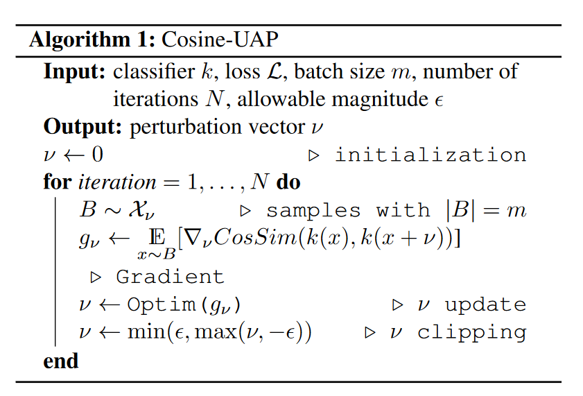
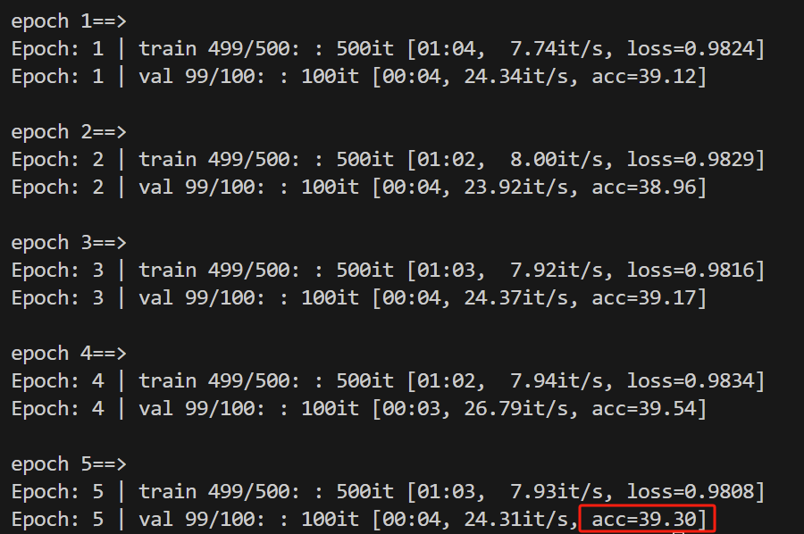

# 1 文件目录
```bash
├── cifar_data # cifar10数据集
│   └── cifar-10-batches-py
│       ├── batches.meta
│       ├── data_batch_1
│       ├── data_batch_2
│       ├── data_batch_3
│       ├── data_batch_4
│       ├── data_batch_5
│       ├── readme.html
│       └── test_batch
├── dataset.py # cifar10数据集定义文件
├── exp # 实验文件夹
│   ├── benign.png
│   ├── uap.pth
│   ├── uap_single*10.png
│   ├── uap_single.png
│   └── weight #训练的模型文件
│       └── best.pth
├── models.py #模型定义文件
├── Readme.md 
├── train_model.py #训练模型
├── requirements.txt #pip安装的库
└── train_uap.py #优化UAP
```

# 2 运行
1. 环境安装
```bash
pip install -r requirements.txt
```

2. 生成被攻击模型
```bash
python train_model.py --seed 你的学号
```

3. 生成UAP
```bash
python train_model.py --seed 你的学号
```

# 3 报告要求
1. Data-free Universal Adversarial Perturbation and Black-box Attack论文阅读报告
    1. 文章链接：https://openaccess.thecvf.com/content/ICCV2021/html/Zhang_Data-Free_Universal_Adversarial_Perturbation_and_Black-Box_Attack_ICCV_2021_paper.html 或者见附件```appendix/Zhang_Data-Free_Universal_Adversarial_Perturbation_and_Black-Box_Attack_ICCV_2021_paper.pdf```
    2. 这个文章讲的是什么？请你做一个不超过500字的概述。
    3. 用你的语言描述```伪代码1```中每一行代表什么？
    
    4. 请你根据论文中```伪代码1```的内容补充```train_uap.py```中算法部分。
    5. 运行代码，记录最终的攻击成功率，并给出代码输出截图。例如：
    
2. 谈一谈这个算法有什么值得改进的地方？（言之有理即可，不作为强制得分点，认真回答会酌情加分。）
3. 确保报告整洁，描述精简，逻辑清晰，不要超过8页。正文字体仿宋四号，1.5倍行距。标题字体不做限制，但是要求用数字方式罗列清晰，报告结构如下：
```
1. 文章概述
2. 伪代码1描述
3. 实验结果
    3.1 UAP可视化结果
    3.2 攻击成功率
4. 改进与思考
```
4. 不需要提交代码和实验结果。
5. 提交截止时间：2024年6月23日23：55前；提交方式：采用模板```appendix/课程设计.doc```，附件提交格式为**pdf**，命名方式为```AI安全-大作业-32221148-张三.pdf```。
