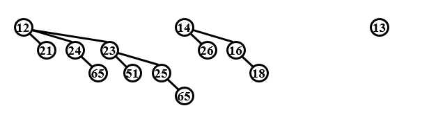
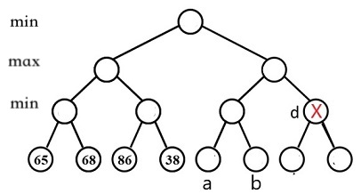

1. Starting with an empty splay tree, if we performance n consecutive insertions, the total cost is O(nlogn) even in the worst case.
2. A binomial queue with 31 keys may consists of 6 binomial trees.
3. Consdier the activity selection (interval scheduling) problem. In class, we have proved that an optimal solution can be obtained by selecting the activities in increasing order of thier finishing time. We can also obtain an optimal solution by selecting the activities in decreasing order of their start time.
4. In class we have proved that the Σ-tree generated by Huffman’s greedy algorithm must be optimal. Note that the optimal Σ-tree is not unique. Is it true that every optimal Σ-tree can be generated by the Huffman’s greedy algorithm?
5. Consider the O(nlogn)-time algorithm for the closest pair problem. Let $\delta=d(p_1,p_2)$ where $(p_1,p_2)$ is the closest pair among the left pairs and the right pairs. Suppose that the ClosestSplitPair subroutine returns a pair $(p_{1}^{s},p_{2}^{s})$. If $(p_{1}^{s},p_{2}^{s})<\delta $, $(p_{1}^{s},p_{2}^{s})$must be the closest split pair.
6. Delete the minimum number from the binomial queue given in the following figure. Which one of the following statements must be FALSE?

A.there are two binomial trees after deletion, which are B2 and B3
B.23 and 14 are both the roots of some binomial trees
C.21 is the child of 13
D.23 and 24 are siblings
7. Gvien the following table, what are the precision and the recall?
Relevant	Irrelevant
Retrieved	21000	7000
Not Retrieved	3000	1000
A.
precision = 75% and recall = 87.5%
B.
precision = 87.5% and recall = 75%
C.
precision = 25% and recall = 12.5%
D.
precision = 12.5% and recall = 25%
8. Consider the following game tree. If node d is pruned by α-β pruning algorithm, which of the following statements about the value of node a or node b must be correct?

A.both are less than or equal to 68
B.both are greater than or equal to 68
C.both are less than or equal to 65
D.both are greater than or equal to 65
9. Let Σ be an alphabet with n symbols. What is the maximum number of bits that Huffman’s algorithm might use to encode a single symbol in Σ?
A.log2(n)
B.ln(n)
C.n−1
D.n
10. Consider the recurrence T(n)=T(n/2)+2T(n/4)+n and T(1)=1. Which of below is the tight upper bound for T(n)? (You may assume that n is a power of 2.)
A.O(n)
B.O(nlogn)
C.O(nlognloglogn)
D.O(n2)
11. Let T be an AVL tree with 19 nodes. What are the possible height of T? (We assume that the height of a single node is 1.)
A.4
B.5
C.6
D.7
12. You are given n jobs, each with a processing time $p 
_j$ and a deadline $d_j$. Given a schedule $\sigma$ of the jobs, we define the lateness of job j as $\lambda_j(\sigma)=\max(C_j(\sigma)−d_j,0)$, where $C_j(\sigma)$ is the completion time of job j in $\sigma$.You task is to find a scheduling $\sigma$ that minimizes the total lateness $\Sigma_j\lambda_j(\sigma)$ . Which of the following greedy algorithm produces an optimal schedule?
A.Schedule the jobs in increasing order of deadline dj
B.Schedule the jobs in increasing order of processing time pj
​C.Schedule the jobs in increasing order of the product dj*pj
D.None of the above works.
13. We have introduced the knapsack problem in class. Which of the following statements are correct?
A.The knapsack problem can be solve in (nC) time where n is the number of items and C is the capacity of the knapsack.
B.The knapsack problem can be solve in (nV) time where n is the number of items and V is the total value of items.
C.The knapsack problem can be solved by greedily selecting items according to their values.
D.The knapsack problem can be solved by greedily selecting items according to their efficiencies (the ratio of value to weight wi/v 
i).
14. 7-1 Find More Coins
Eva loves to collect coins from all over the universe, including some other planets like Mars. One day she visited a universal shopping mall which could accept all kinds of coins as payments. However, there was a special requirement of the payment: for each bill, she must pay the exact amount. Since she has as many as 10 
4
  coins with her, she definitely needs your help. You are supposed to tell her, for any given amount of money, whether or not she can find some coins to pay for it.

Input Specification:
Each input file contains one test case. For each case, the first line contains 2 positive numbers: N (≤10 
4
 , the total number of coins) and M (≤10 
2
 , the amount of money Eva has to pay). The second line contains N face values of the coins, which are all positive numbers. All the numbers in a line are separated by a space.

Output Specification:
For each test case, print in one line the face values V 
1
​
 ≤V 
2
​
 ≤⋯≤V 
k
​
  such that V 
1
​
 +V 
2
​
 +⋯+V 
k
​
 =M. All the numbers must be separated by a space, and there must be no extra space at the end of the line. If such a solution is not unique, output the smallest sequence. If there is no solution, output "No Solution" instead.

Note: sequence {A[1], A[2], ...} is said to be "smaller" than sequence {B[1], B[2], ...} if there exists k≥1 such that A[i]=B[i] for all i<k, and A[k] < B[k].

Sample Input 1:
8 9
5 9 8 7 2 3 4 1
Sample Output 1:
1 3 5
Sample Input 2:
4 8
7 2 4 3
Sample Output 2:
No Solution